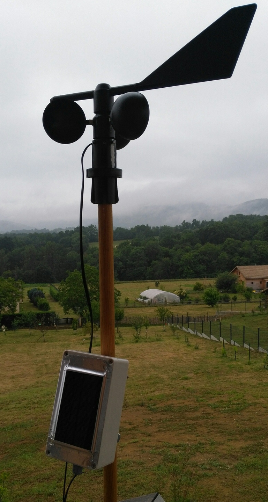

# MkrfoxWindShield
Arduino Mkrfox1200 interface to wind sensors

## About this project
    OpenWindMap is a network of wind sensors (https://www.openwindmap.org), 
    collecting data from the devices via the Sigfox network.
    
    This project is about building a device (hardware and software) to process 
    the measurements from commercial wind sensors and send data via Sigfox 
    messages (8 bits every 10min). The device is powered by a small battery and
    a solar panel (power management is included on the shield).
    
    This project has a broader scope than the former one (https://github.com/pcaunegre/SWiM) because:
    - it supports 3 types of commercial sensors
    - it includes a Printed Circuit Board (PCB) design to go as a shield for the Arduino Mkrfox1200
      so that the complete device can be quickly assembled without soldering 
    
    I have a few shields left that I can distribute upon request (pascal.caunegre@gmail.com)

    

## This project includes several independant modules:

### Hardware
    The hardware is an Arduino shield compatible with the MKRFOX1200 board.
    All material (schematics, layout, docs) are provided here.
    The shield provides an interface with one among three types of wind sensors:
    - Davis
    - Peet Bros
    - MiSol (Shenzen)

### Software 
    The software automatically identifies the sensor type, controls the wind sensor 
    and sends measures via Sigfox.
    If the device is registered by the OpenWindMap network, measures will appear 
    on the web (http://www.openwindmap.org/)

    Please read the manual (doc/Manual.pdf) for more information.

